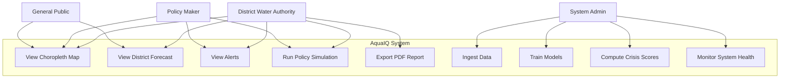
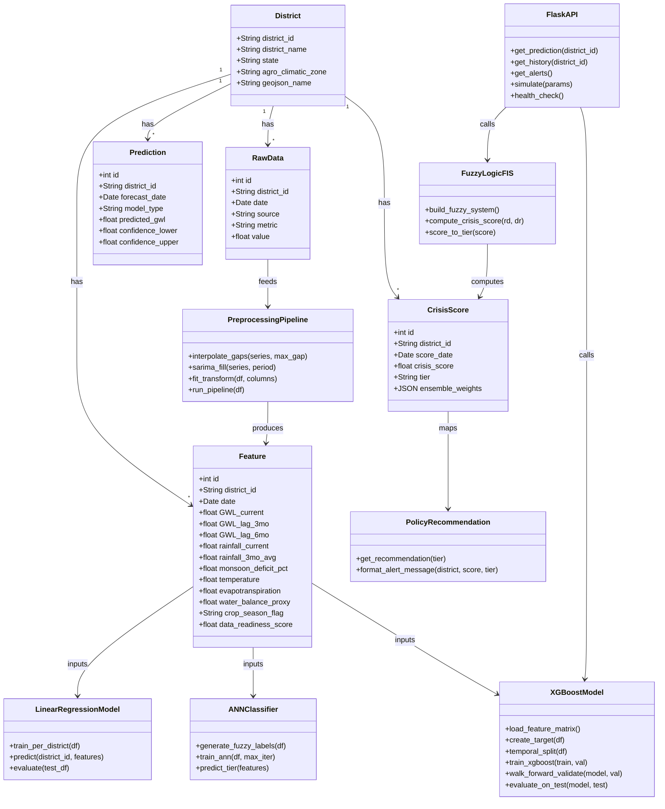
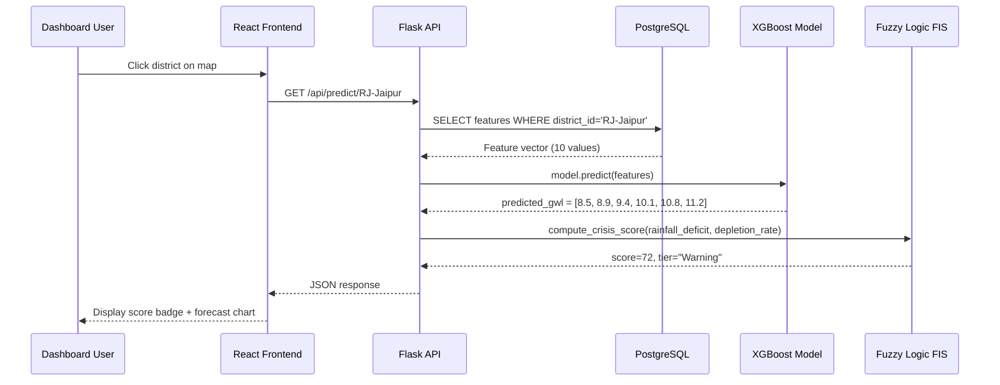
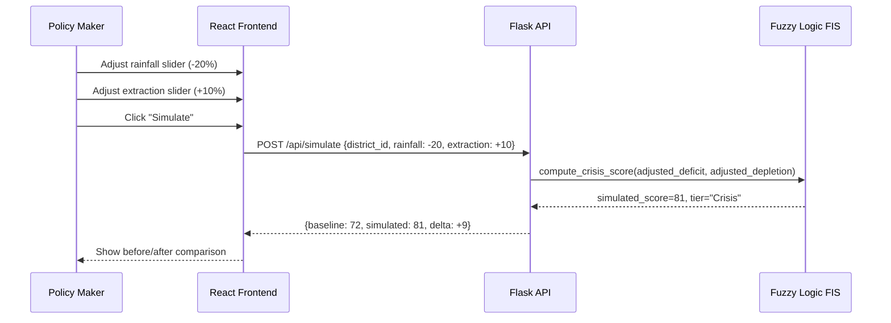
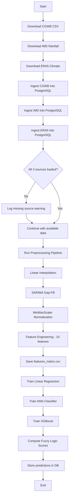
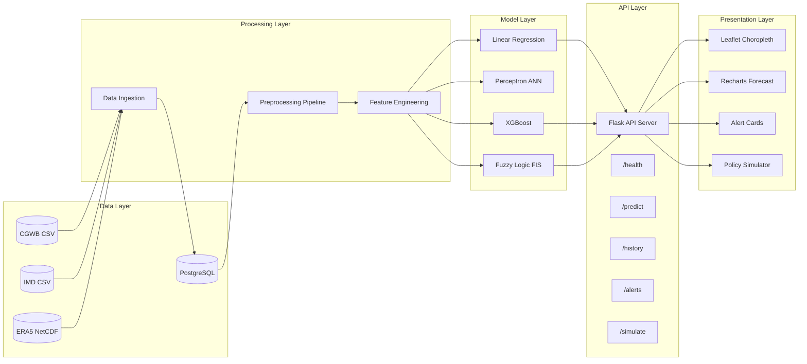
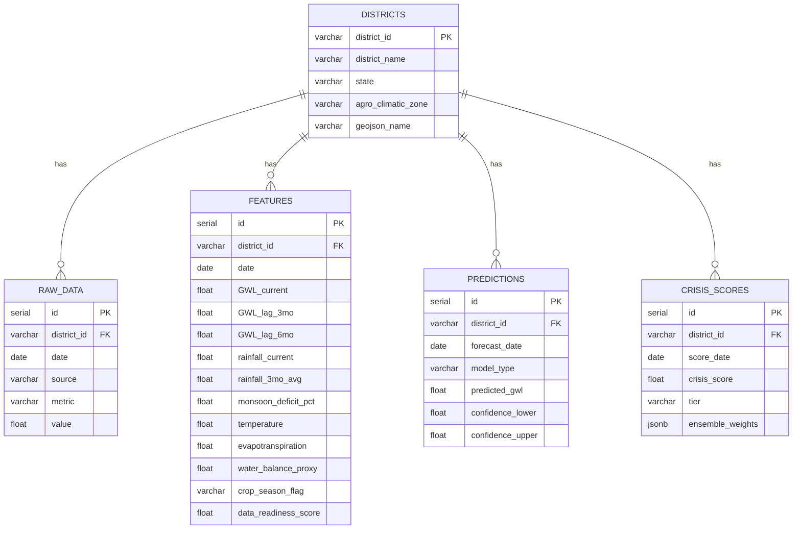

# AquaIQ — UML Diagrams

## 1. Use Case Diagram

---

## 2. Class Diagram

---

## 3. Sequence Diagram — Prediction Flow

---

## 4. Sequence Diagram — Policy Simulation

---

## 5. Activity Diagram — Data Pipeline

---

## 6. Component Diagram

---

## 7. ER Diagram (Database)

